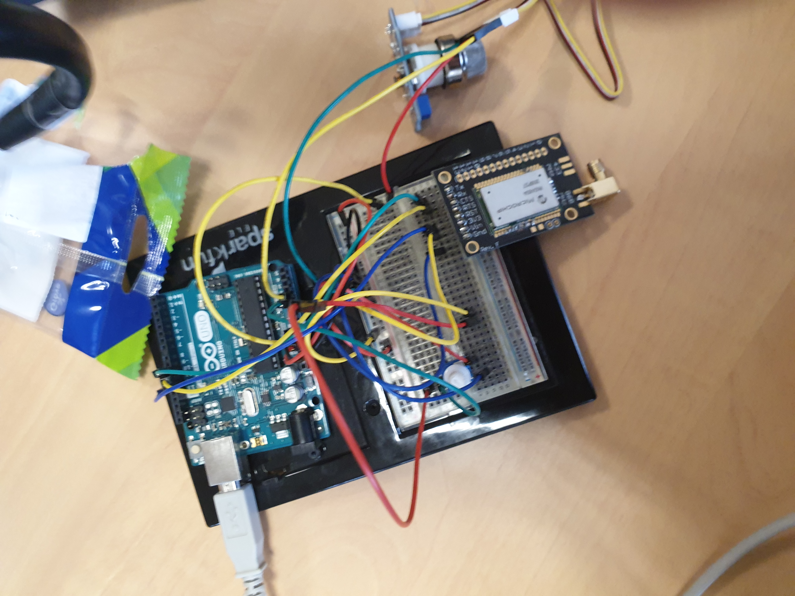

# Projet Smart Device
# MICRO-CONTROLEURS ET OPEN-SOURCE HARDWARE:
# Projet de Construction d'un capteur de gaz 
>LAURENS [Pierre](mailto:plaurens@etud.insa-toulouse.fr) - TOUZANI Ismail 
<a href="./README_EN.md">Version Anglaise</a>

Ce projet, faisant partie du Master 5ISS de l'INSA Toulouse, a été developpé dans le but de créer un capteur de gas intelligent capable de détecter plusieurs types de gas qui pourront être dangereux pour la santé humaine.
Après avoir construit le capteur dans l'atelier AIME de l'INSA, il sera donc nécessaire de le régler pour en extraire les informations utiles: cela se fera grâce au logiciel LTSpice IV pour la partie éléctronique analogique. Ensuite, et afin de récupérer les données du capteur et les communiquer à travers le réseau LoRA, on utilisera une carte Arduino Uno et une puce RN2483. Enfin, nous utiliserons le logiciel KiCAD pour effectuer le schéma adéquat du câblage entre les différents composants.

# Contenu du Projet
Le projet est constitué des répertoires suivants:
-   **KiCAD**: Contient les fichiers nécessaires à la réalisation du PCB.
-   **Mosh (Arduino IDE)**: Contient les fichiers des tps effectués en utilisant l'IDE d'Arduino ainsi que les fichiers du projet.
-   **LTSpice**: Contient les fichiers nécessaires à la partie éléctronique analogique.

  
### Partie collection de données et communication LoRA: 
Dans cette partie, nous avons testé la collection de données et communication LoRA avec un capteur de test:

### Partie construction du shield/PCB: 
Dans cette partie, nous avons construit notre propre shield/PCB grâce à KiCAD :

Pour finir, nous avons réalisé un plan de masse:

Nous avons réalisé un plan de masse pour réduire la consommation en cuivre et limiter le routage en une seule couche. En effet, nous avons  supprimé toutes les routes sur la couche avant de notre shield(rouge) présentent sur la photo ci-dessus.
Le plan de masse permet également de réaliser le routage sur une seule couche, la couche arrière  de notre Shield. Pour finir, nous avons ainsi respecté les contraintes de routage définies par l'INSA.
### Partie électronique analogique: 
Concernant cette partie, nous avons étudier, en utilisant LTSPice IV, la partie électronique analogique du module Smart Device où nous serons amené à mesurer la résistance, le faible courant avec un microcontrôleur et effectuer un filtrage passe bas pour extraire les informations utiles de notre capteur de gaz. 

<a href="/LTspice/UF_Smart_Device_ Partie_analogique_avec_LTSpice_IV.pdf">Rapport_LTSPice</a>
