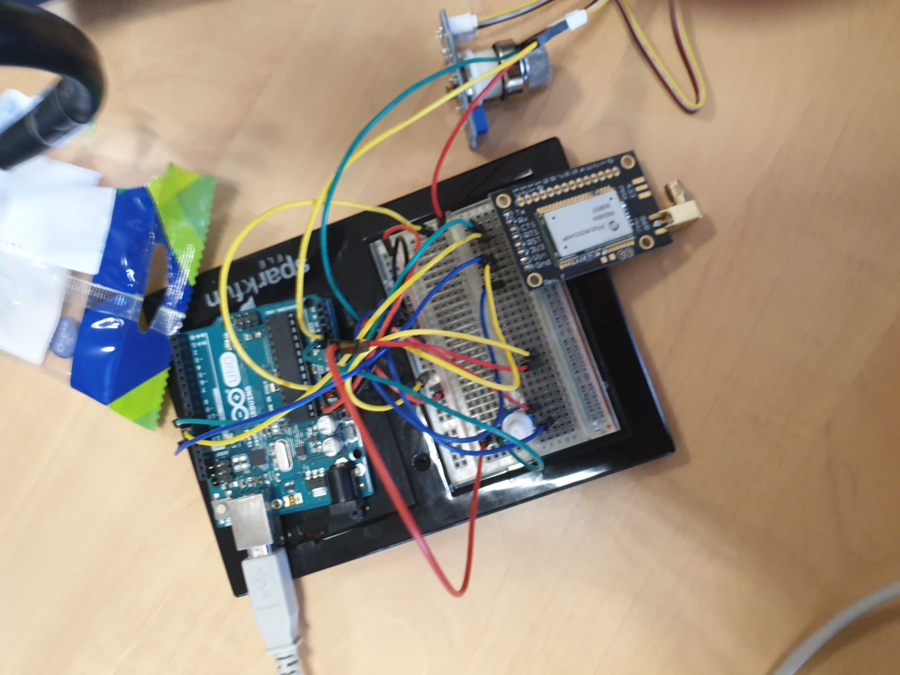

# Smart Device Project
# MICROCONTROLLERS AND OPEN-SOURCE HARDWARE:
# Gas Sensor Construction Project

    LAURENS Pierre - TOUZANI Ismail
>LAURENS [Pierre](mailto:plaurens@etud.insa-toulouse.fr) - TOUZANI Ismail 

<a href="./README.md">French version</a>

This project, part of the Master 5ISS of INSA Toulouse, was developed with the aim of creating an intelligent gas sensor capable of detecting several types of gas that could be dangerous to human health. After having built the sensor in the AIME workshop of INSA, it will be necessary to adjust it to extract the useful information: this will be done using the LTSpice IV software for the analogical electronic part. Then, in order to retrieve the sensor data and communicate them through the LoRA network, an Arduino Uno card and a RN2483 chip will be used. Finally, we will use the KiCAD software to make the appropriate wiring diagram between the different components.
Content of the Project

# Contenu du Projet
The project consists of the following directories:
-   **KiCAD**: Contains the files needed to build the PCB.
-   **Mosh (Arduino IDE)**: Contains the files of the gps performed using the Arduino IDE as well as the project files.
-   **LTSpice**: Contains the files needed for the analog electronic part.

  
### Data collection and LoRA communication part:
In this section we have tested the LoRA data collection and communication with a test sensor:

### Construction part of the shield/PCB:
In this part, we have built our own shield/PCB thanks to KiCAD :

Finally, we have made a ground plan:

We carried out a ground plan to reduce copper consumption and limit single-layer routing. Indeed, we removed all the routes on the front layer of our shield(red) present on the picture above. The ground plan also allows us to do the routing on a single layer, the back layer of our Shield. Finally, we have respected the routing constraints defined by the INSA.

### Analog electronic part:
Concerning this part, we have studied, using LTSPice IV, the analog electronic part of the Smart Device module where we will measure the resistance, the low current with a microcontroller and perform a low-pass filtering to extract the useful information from our gas sensor.

<a href="/LTspice/UF_Smart_Device_ Partie_analogique_avec_LTSpice_IV.pdf">Rapport_LTSPice (french version)</a>
